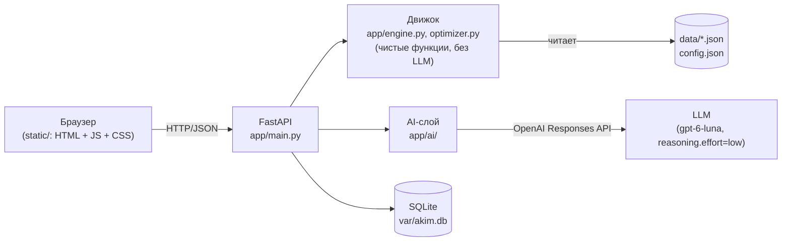

# Аким на 5 часов — AI-симулятор управления городом

## 1. Что это

Веб-симулятор по датасету организаторов хакатона: вы выбираете ровно 5 городских мероприятий (для районных мер — ещё и район) в пределах бюджета 100 условных единиц, движок детерминированно считает Astana Quality of Life Score, а AI объясняет результат и предлагает проверенное движком улучшение.

> Скриншоты интерфейса обычно лежат в `docs/screenshots/` — в этой сборке их нет, см. раздел «Ограничения»: интерфейс проверен через API (см. раздел 3/7), а не визуально.

## 2. Быстрый старт

```bash
cp .env.example .env
# при желании впишите свой ключ в LLM_API_KEY внутри .env
docker compose up --build
# откройте http://localhost:8000
```

Без ключа всё работает, AI-тексты заменяются шаблонными.

## 3. Сценарий использования

1. **Выбор решений.** В левой колонке заполните 5 слотов: мера + (для районных мер) район. Недоступные варианты сразу показывают причину («уже выбрано», «лимит направления 2/2», «несовместимо с M3», «не хватает N усл. ед.»).
2. **Превью Score.** При каждом изменении (debounce 150 мс) фронтенд шлёт `POST /api/simulate` — шапка (бюджет, Score, критические значения), плитки районов и график вкладов обновляются мгновенно, без обращения к AI.
3. **Анализ.** Когда набор из 5 решений валиден, кнопка «Рассчитать и проанализировать» становится активной. Она вызывает `POST /api/scenario`: движок считает финальный Result, AI (или фолбэк) пишет разбор — сильные стороны, риски, последствия, главный компромисс.
4. **Агент.** Кнопка «Найти улучшение» вызывает `POST /api/optimize`: агент (или hill_climb-фолбэк) перебирает гипотезы и предлагает набор со Score не хуже исходного. Список проверенных гипотез виден целиком; «Применить» подставляет найденный набор в слоты.
5. **Лидеры.** Каждый сохранённый сценарий попадает в таблицу `GET /api/leaderboard` (топ-50 по Score); клик по строке разворачивает её 5 решений.

## 4. Архитектура



| Модуль | Назначение |
|---|---|
| `app/main.py` | FastAPI-роуты, раздача `static/`, обработка ошибок |
| `app/models.py` | Pydantic-схемы запросов |
| `app/data_loader.py` | Загрузка и валидация `data/*.json` и `config.json` при старте |
| `app/engine.py` | `simulate()`, `validate()`, `contributions()` — формула Score дословно из спецификации |
| `app/optimizer.py` | Детерминированный поиск: `single_swap_search()`, `hill_climb()`, `brute_force()` |
| `app/storage.py` | SQLite: `save_scenario()`, `leaderboard()` |
| `app/ai/llm.py` | Единственное место вызова LLM (OpenAI SDK, Responses API); смена провайдера или модели — правка только этого файла / `.env` |
| `app/ai/analyst.py` | AI-анализ сценария + шаблонный фолбэк |
| `app/ai/agent.py` | Агент-оптимизатор с инструментами (`simulate`, `list_measures`, `get_district`) + hill_climb-фолбэк |
| `app/ai/prompts.py` | Промпты дословно из спецификации |

## 5. Модель расчёта

Для каждого решения `(measure, district?)` эффект применяется с учётом лага:

```
I = копия базовых показателей районов
для каждого решения:
    f = (H − lag) / H,  H = horizon_quarters = 8
    цели = все районы, если scope == "city", иначе один выбранный район
    I[район][показатель] += эффект × f     # без обрезки на этом шаге
для каждой сработавшей синергии (обе меры пары выбраны):
    I[район хоста][показатель синергии] += бонус
I = clip(I, 0, 100)                          # обрезка один раз, в самом конце
```

```
D_район       = Σ (вес_показателя × I_показатель)               по 10 показателям
D_avg         = Σ (доля_населения_района × D_район)
Score         = 0.7 × D_avg + 0.3 × min(D_район) − 1.0 × N_crit
```

`N_crit` — число пар «район × показатель» строго ниже `crit_threshold` (40) после итоговой обрезки. Обрезка выполняется один раз в конце, поэтому Score не зависит от порядка решений в наборе.

Параметры `config.json`:

| Параметр | Значение | Зачем |
|---|---|---|
| `budget` | 100 | верхняя граница суммарной стоимости 5 решений |
| `decisions_count` | 5 | ровно столько решений в наборе |
| `max_per_direction` | 2 | не даёт «закрыть» весь бюджет одним направлением |
| `horizon_quarters` | 8 | горизонт симуляции в кварталах — определяет, какая доля эффекта меры с лагом успевает реализоваться |
| `lambda` | 0.7 | вес среднего по городу балла против самого слабого района — задаёт компромисс «рост среднего» vs «подтягивание отстающих» |
| `crit_threshold` | 40 | порог, ниже которого показатель считается критическим |
| `crit_penalty` | 1.0 | штраф за каждое критическое значение — стимулирует не оставлять районы без внимания |
| `synergies` | 3 пары | бонус за взаимодополняющие меры (напр. умные светофоры усиливают выделенные полосы) |
| `incompatibilities` | 3 пары | взаимоисключающие меры (конкурирующие технологии или конфликт за участок) |

## 6. Как устроен AI

**Аналитик** (`app/ai/analyst.py`) — один вызов `complete_json`. Получает только посчитанные движком числа (вклад каждой меры, сработавшие синергии, критические значения, показатели районов до/после) и объясняет их; ничего не считает и не выдумывает. Ответ проверяется на бэкенде (все поля на месте, `weakest_district` существует); при сбое — одна повторная попытка, затем шаблонный фолбэк.

**Агент-оптимизатор** (`app/ai/agent.py`) — вызывает `run_tools` с лимитом `AGENT_MAX_TOOL_CALLS` (8). Инструменты:

| Инструмент | Что делает |
|---|---|
| `simulate` | Считает Score движком для гипотезы агента, ничего не выдумывает |
| `list_measures` | Отдаёт каталог мер (опционально по направлению) с их синергиями/несовместимостями |
| `get_district` | Отдаёт показатели и D конкретного района |

Каждый вызов `simulate` попадает в лог гипотез. Пример реального лога (набор организаторов, `POST /api/optimize`, фолбэк-режим — hill_climb):

```json
{
  "original_score": 56.54,
  "best_score": 57.21,
  "delta": 0.66,
  "source": "baseline",
  "hypotheses": [
    {
      "idea": "Заменить «Перевод частного сектора на чистое топливо» в Сарыарка на «Линия ЛРТ / расширение» в Нура",
      "score": 57.21,
      "valid": true,
      "error": null
    }
  ]
}
```

`best_decisions` всегда прогоняются через `validate()` и `simulate()` движка — Score в ответе не может быть выдуман AI. Параллельно всегда считается `hill_climb()` от исходного набора; если он дал больше, чем агент (или ключа нет), возвращается он: `source: "baseline"`. Если найденный Score всё равно ниже исходного — возвращается исходный набор с `delta: 0`.

**Фолбэк без LLM** срабатывает, если нет `LLM_API_KEY`, вызов упал (`LLMUnavailable`) или ответ не прошёл проверку — в любом случае API отвечает `200`, а не `5xx`, с `ai_mode: "fallback"`.

## 7. Проверка требований

| Требование | Как проверить |
|---|---|
| AC1: `docker compose up --build` поднимает приложение на :8000 | `docker compose up --build`, затем `curl localhost:8000/api/health` |
| AC2: одинаковые бюджет и данные у всех | `GET /api/state` детерминирован — `tests/test_api.py::test_state` |
| AC3: нарушение правил → кнопка неактивна, `POST /api/scenario` → 422 | `tests/test_api.py::test_scenario_over_budget_is_422`; в UI — `app.js:renderCalcButton` |
| AC4: базовый Score 52,56, пример 56,54 | `tests/test_engine.py::test_score_and_ncrit` |
| AC5: порядок решений не важен | `tests/test_engine.py::test_order_independent` (120 перестановок) |
| AC6: замена решения меняет Score | `tests/test_engine.py::test_sensitivity` (117 вариантов, допуск 1e-9) |
| AC7: `POST /api/scenario` даёт `strengths/risks/consequences/main_tradeoff` | `tests/test_api.py::test_scenario_example` |
| AC8: `POST /api/optimize` не хуже исходного + лог гипотез | `tests/test_api.py::test_optimize_example` |
| AC9: без `LLM_API_KEY` всё работает, `ai_mode: "fallback"` | `tests/test_ai_fallback.py`, `docker compose up` с пустым `LLM_API_KEY` |
| AC10: pytest проходит | `docker compose run --rm app pytest` |
| AC11: README содержит все разделы | этот файл |
| Ровно 5 решений, без повторов, район для районных мер | `app/engine.py::validate` — коды `INVALID_COUNT`, `DUPLICATE_MEASURE`, `DISTRICT_REQUIRED`, `DISTRICT_NOT_ALLOWED` |
| Бюджет ≤ 100 | `validate` → `BUDGET_EXCEEDED`; UI — блокировка недостающих усл. ед. в селекте |
| Не больше 2 мер одного направления | `validate` → `DIRECTION_LIMIT`; UI — счётчики направлений над слотами |
| Запрещённые пары (M1×M3, M4×M7 в районе, M5×M13 в районе) | `validate` → `INCOMPATIBLE`; тесты `test_conflict_site`, `test_site_ok_is_valid`, `test_conflict_transport` |

## 8. Результаты

| Сценарий | Score |
|---|---|
| Базовый (без решений) | **52.56** |
| Набор организаторов (EXAMPLE) | **56.54** |
| Улучшение агента/hill_climb от набора организаторов | **57.21** |
| Глобальный максимум (`scripts/brute_force.py`, 694 395 допустимых наборов) | **57.24** |

```
$ docker compose run --rm app python scripts/brute_force.py
Валидных наборов: 694395
Минимальный Score: 52.04
Максимальный Score: 57.24
Топ-5 сценариев:
1. Score 57.24: M2, M3@nura, M8@nura, M9@nura, M14
2. Score 57.23: M3@nura, M4@nura, M8@nura, M9@nura, M14
3. Score 57.21: M3@nura, M7@nura, M8@nura, M10@nura, M12
4. Score 57.19: M3@nura, M8@nura, M9@nura, M10@nura, M14
5. Score 57.17: M3@nura, M8@nura, M9@nura, M12, M14
```

## 9. Тесты

```bash
docker compose run --rm app pytest
```

- `tests/test_engine.py` — формула Score, все фикстуры из спецификации (базовые D районов, 10 сценариев, коды ошибок, лаг, синергии, независимость от порядка, чувствительность к замене, диапазон [0,100] на 1000 случайных наборах, вклады, hill_climb, brute_force). Медленный тест `brute_force` (694 395 наборов, ~6–7 секунд) помечен `@pytest.mark.slow` и запускается вместе со всеми остальными по умолчанию; чтобы пропустить его — `pytest -m "not slow"`.
- `tests/test_api.py` — `/api/state`, `/api/simulate`, `/api/scenario`, `/api/optimize`, `/api/leaderboard` без ключа LLM.
- `tests/test_ai_fallback.py` — `llm.py` подменяется моками (исключение и невалидный JSON); проверяется, что API всегда отвечает 200 с `ai_mode: "fallback"`, а агент при нарушающем правила ответе LLM возвращает результат `hill_climb`.

## 10. Ограничения

- Данные (районы, меры, синергии) синтетические, взяты из датасета организаторов без изменений.
- Коэффициенты формулы (веса показателей, `lambda`, штраф за критичность) экспертные и не откалиброваны на реальных данных Астаны.
- Разрешено не больше одного экземпляра каждой меры на набор и не больше 2 мер одного направления — расширенные (мультирайонные) сценарии одной меры не поддерживаются.
- Скриншоты UI (`docs/screenshots/`) не приложены: среда, где собирался проект, не имела браузера/headless-Chromium (расширение Claude in Chrome не было подключено на момент сборки). Все сценарии из раздела 3 проверены через API (curl/pytest) и логику `static/app.js`, а не визуально.

## 11. Развитие

- Подключение открытых данных акимата Астаны вместо синтетического датасета.
- Калибровка весов показателей и `lambda` по опросам жителей районов.
- Многолетний режим с накоплением отложенных (лаговых) эффектов между периодами планирования.
- Сравнение предложенных сценариев с реальными бюджетными программами города.
