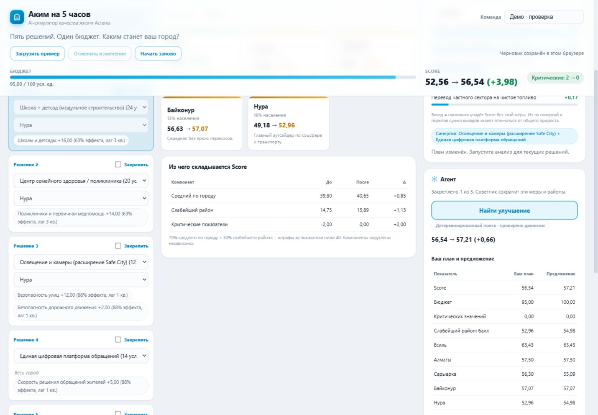
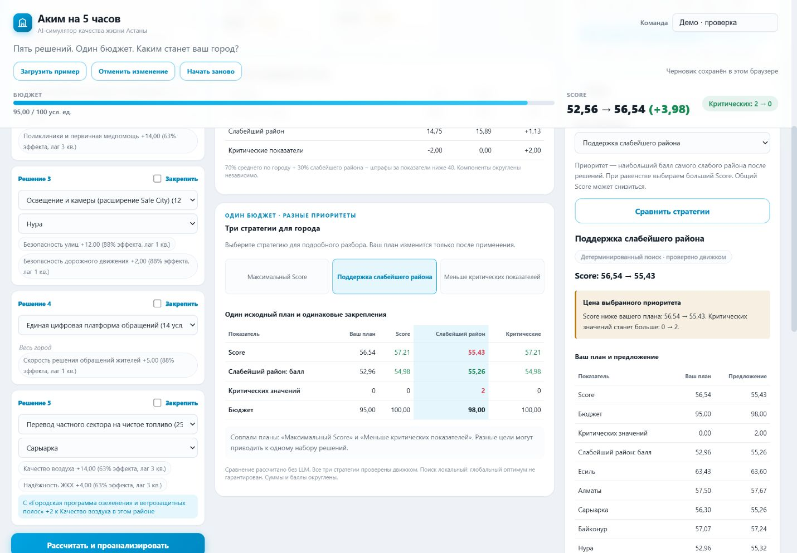

# Проверка «Аким на 5 часов» — 23 сентября 2026

Проверена локальная Docker-сборка проекта. Данные организаторов, бюджет 100, пять решений, лимит двух мер направления и формула Score сохранены.

## Автоматические проверки

| Проверка | Результат |
|---|---|
| `python -m pytest -q` | 107 passed, включая полный перебор |
| `node --test tests/frontend.test.cjs` | 12 passed |
| `docker compose up --build -d --wait` | Образ собран, сервис запущен и healthy |
| `docker compose run --rm -e LLM_API_KEY= app pytest -q` | 107 passed на Python 3.11 внутри контейнера |

Тесты отключают реальные LLM-вызовы и используют временную базу. Node.js нужен только для тестов фронтенда; приложение запускается без Node и npm. Workflow `.github/workflows/test.yml` добавлен; удалённый прогон GitHub Actions в рамках этой проверки не выполнялся.

## Проверка основного сценария

Эти проверки выполнены до добавления трёх целей. Живой AI был подтверждён в прежнем режиме максимизации Score; текущая проверка новых целей описана отдельно ниже.

1. Загрузка приложения: базовый Score 52,56; итоговые кнопки неактивны при незаполненных слотах.
2. «Загрузить пример»: пять мер, бюджет 95/100, Score 56,54, критических показателей 0.
3. Закрепление школы в Нуре: оба селекта становятся недоступны, советник показывает одно закрепление.
4. Перезагрузка: набор, закрепление и название команды восстановлены из локального черновика.
5. Анализ с настроенным ключом: получен реальный AI-текст с итогом, сильными сторонами, рисками, последствиями и главным компромиссом. В интерфейсе показан режим AI-анализа.
6. Оптимизация с закреплённой школой: `ai_mode: "llm"`, `source: "baseline"`, три шага в журнале. Итог 57,21, дельта 0,66 (считается до округления), бюджет 100. AI участвовал, но выбран более высокий результат детерминированного поиска.
7. Сравнение: Нура 52,96 → 54,98; Сарыарка 56,30 → 55,09. Видно, что общий рост сопровождается ухудшением отдельного района.
8. Применение: школа остаётся закреплённой, устаревший анализ удаляется. Отмена возвращает прежние решения и закрепления.
9. Ширины 1440 и 390 px проверены визуально; горизонтальное переполнение страницы на телефоне устранено. Консоль браузера без ошибок и предупреждений в проверенной сессии.

[Полный экран со сравнением](screenshots/desktop.png) · [Мобильный экран](screenshots/mobile.png)

## Проверка трёх стратегий

На наборе «Загрузить пример» без закреплений детерминированный поиск дал следующие результаты:

| Вариант | Score | Минимальный балл района | Критических | Бюджет |
|---|---:|---:|---:|---:|
| Исходный | 56,54 | 52,96 | 0 | 95 |
| Максимальный Score | 57,21 | 54,98 | 0 | 100 |
| Поддержка слабейшего района | 55,43 | 55,26 | 2 | 98 |
| Меньше критических показателей | 57,21 | 54,98 | 0 | 100 |

- В браузере показаны три стратегии и исходный план; совпадение наборов для Score и критических показателей обозначено текстом.
- Просмотр альтернативы сохраняет исходный план. Для `weakest` виден явный компромисс: более высокий минимум районов, но меньший Score и два критических значения.
- Применение `weakest` даёт Score 55,43 и бюджет 98; отмена возвращает Score 56,54 и бюджет 95. Цель восстанавливается после перезагрузки.
- Фокус клавиатуры сохраняется на выбранной кнопке стратегии после обновления подробностей.
- Ширины 1440 и 390 px проверены визуально. На телефоне таблица прокручивается внутри карточки, переполнения всей страницы нет. Консоль проверенной сессии без ошибок и предупреждений.
- Закрепления, сравнение неокруглённых значений, разные цели, выбор предложения AI и защита от устаревших ответов покрыты Python- и JS-регрессиями.
- При живых запросах новой цели `weakest` провайдер не вернул пригодный JSON; API ответил успешно в явно обозначенном резервном режиме. Успешный живой AI-поиск для новой цели в этой проверке **не подтверждён**. Невалидный JSON теперь не кэшируется; повторное обращение и сохранение валидных ответов проверены 20 тестами с подменой провайдера.

[Мобильный экран стратегий](screenshots/strategies-mobile.png)

## Сценарий демонстрации жюри, 2–3 минуты

1. Загрузить пример и показать бюджет, Score и исчезновение критических показателей.
2. Объяснить три компонента Score; открыть показатели Нуры.
3. Нажать «Сравнить стратегии» и сопоставить три цели: повышение общего Score против повышения минимального балла района.
4. Выбрать «Поддержка слабейшего района», показать цену приоритета, применить и отменить.
5. Закрепить школу: «Это обязательство команды». Повторить сравнение и показать, что она сохранена. Совпадение стратегий при ограничениях — допустимый результат.

Если LLM недоступна, анализ и поиск переходят в явно обозначенный резервный режим. Прямо на защите следует отличать AI-анализ от шаблонного и источник найденного плана от участия AI в поиске.

## Границы проверки

Проверены конкретные сценарии и регрессии, а не все браузеры и сетевые условия. Нагрузочное тестирование и внешнее публичное развёртывание не выполнялись. Синтетическая модель не откалибрована для прогнозирования реального города; произвольный текст AI всё ещё требует содержательной оценки человеком.
